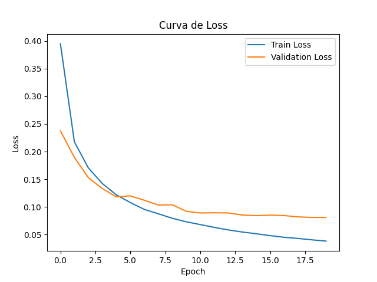
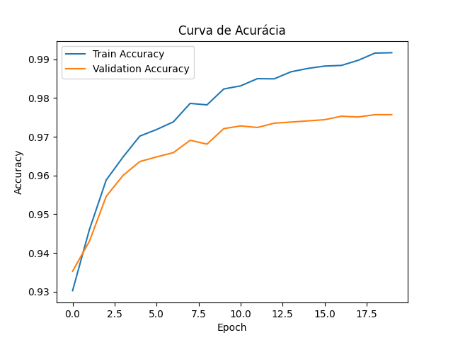
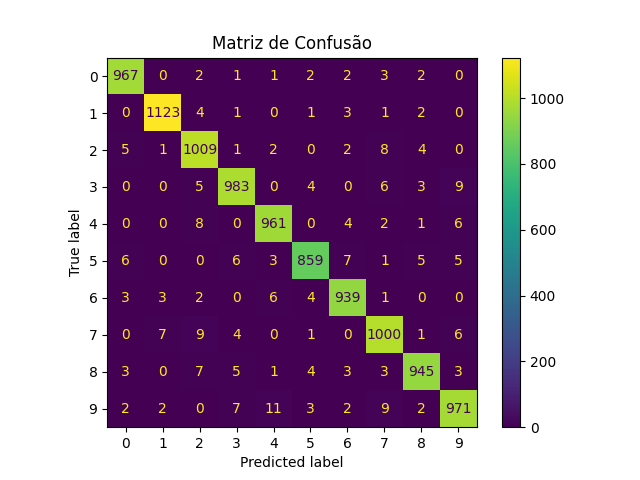

# MLP do Zero com NumPy para Classificação de Dígitos MNIST

## Visão Geral

Este projeto consiste na implementação de um Multi-Layer Perceptron (MLP). O objetivo foi compreender o funcionamento de uma rede neural, implementando manualmente todas as etapas do treinamento, incluindo forward pass, backpropagation, atualização dos pesos por Stochastic Gradient Descent (SGD) e teste do otimziador Momentum. O dataset utilizado foi MNIST.

---

## Como Rodar

### 1. Clonar o repositório

```bash
git clone https://github.com/gomes-raf/ponderada_MLP
cd ponderada_MLP
```

### 2. Criar ambiente virtual

```bash
python -m venv .venv
```

### 3. Ativar ambiente virtual

Windows:

```bash
.venv\Scripts\activate
```

Linux/MacOS:

```bash
source .venv/bin/activate
```

### 4. Instalar dependências

```bash
pip install -r requirements.txt
```

### 5. Executar treinamento

```bash
python train.py
```

Os resultados serão exibidos no terminal e os gráficos serão salvos na pasta `results/`.

---

## Estrutura do Projeto

```text
.
├── README.md
├── train.py
├── requirements.txt
├── mlp/
│   ├── __init__.py
│   ├── network.py
│   ├── activations.py
│   ├── losses.py
│   └── optimizers.py
├── notebooks/
│   └── experimentos.ipynb
└── results/
```

---

## Arquitetura Escolhida

Foram avaliadas duas arquiteturas distintas.

### Experimento 1

```text
784 → 128 → 64 → 10
```

* Entrada: 784 neurônios (28x28 pixels)
* Camada Oculta 1: 128 neurônios
* Camada Oculta 2: 64 neurônios
* Saída: 10 neurônios

### Experimento 2

```text
784 → 64 → 10
```

* Entrada: 784 neurônios
* Camada Oculta: 64 neurônios
* Saída: 10 neurônios

### Funções utilizadas

* Ativação das camadas ocultas: ReLU
* Camada de saída: Softmax
* Função de perda: Cross Entropy
* Otimizadores avaliados:

  * SGD
  * Momentum
* Inicialização dos pesos: He Initialization

A escolha da ReLU foi feita devido à simplicidade computacional e ao bom desempenho em redes profundas. A inicialização de He foi utilizada para evitar problemas de gradientes muito pequenos durante o treinamento.

Além do SGD tradicional, foi implementado o otimizador Momentum como requisito opcional da atividade, permitindo comparar diferentes estratégias de atualização dos pesos.

---

## Implementação

### `activations.py`

Responsável pelas funções de ativação:

* ReLU
* Derivada da ReLU
* Softmax

### `losses.py`

Implementação da função de perda:

* Cross Entropy

### `optimizers.py`

Implementação dos algoritmos de otimização:

* Stochastic Gradient Descent (SGD)
* Momentum

### `network.py`

Implementação completa do MLP:

* Inicialização dos pesos
* Forward Pass
* Backpropagation
* Atualização dos pesos
* Predição
* Avaliação
* Treinamento em mini-batches
* Suporte a múltiplos otimizadores

### `train.py`

Responsável por:

* Carregar o dataset MNIST
* Pré-processamento dos dados
* Treinamento da rede
* Avaliação
* Geração dos gráficos
* Geração da matriz de confusão
* Comparação entre arquiteturas e otimizadores

---

## Resultados

### Experimento 1 — Arquitetura 784-128-64-10

| Métrica             | Resultado |
| ------------------- | --------- |
| Loss Final (Treino) | 0.1017    |
| Accuracy Treino     | 97.31%    |
| Loss Teste          | 0.1114    |
| Accuracy Teste      | 96.67%    |

### Experimento 2 — Arquitetura 784-64-10

| Métrica             | Resultado |
| ------------------- | --------- |
| Loss Final (Treino) | 0.1770    |
| Accuracy Treino     | 95.08%    |
| Loss Teste          | 0.1752    |
| Accuracy Teste      | 94.77%    |

---

## Comparação das Arquiteturas

| Experimento | Arquitetura   | Learning Rate | Batch Size | Épocas | Accuracy Teste |
| ----------- | ------------- | ------------- | ---------- | ------ | -------------- |
| 1           | 784-128-64-10 | 0.01          | 64         | 20     | 96.67%         |
| 2           | 784-64-10     | 0.01          | 64         | 20     | 94.77%         |

### Análise

A arquitetura com duas camadas ocultas apresentou melhor desempenho, atingindo 96.67% de acurácia no conjunto de teste.

A presença de uma segunda camada oculta aumentou a capacidade da rede de aprender representações mais complexas dos dígitos manuscritos, resultando em uma melhora de aproximadamente 1.9 pontos percentuais na acurácia final.

---

## Comparação de Otimizadores

Para complementar os experimentos, foi implementado o otimizador Momentum e comparado com o SGD tradicional utilizando a arquitetura ``` 784 → 64 → 10 ``` para entendimento de se esse poderia aumentar ainda mais a perfomance do modelo de menor desempenho.

### Resultados

| Otimizador | Accuracy Treino | Accuracy Teste | Loss Teste |
| ---------- | --------------- | -------------- | ---------- |
| SGD        | 95.08%          | 94.77%         | 0.1752     |
| Momentum   | 99.17%          | 97.57%         | 0.0807     |

### Análise

O uso de Momentum resultou em uma melhora significativa no desempenho da rede.

Enquanto o SGD tradicional atingiu 94.77% de acurácia no conjunto de teste, o Momentum alcançou 97.57%, representando um ganho de aproximadamente 2.8 pontos percentuais.

Além da melhora na acurácia, observou-se uma convergência muito mais rápida. Já na primeira época o modelo com Momentum atingiu 93.53% de acurácia de validação, enquanto o SGD tradicional iniciou com 87.96%.

---

## Curvas de Treinamento

Os seguintes gráficos são gerados automaticamente:

* `results/loss_curve.png`

* `results/accuracy_curve.png`


Observou-se uma redução contínua da loss ao longo das épocas, indicando que os gradientes foram calculados corretamente e que o processo de treinamento convergiu adequadamente.

Da mesma forma, a acurácia apresentou crescimento consistente tanto no conjunto de treino quanto no conjunto de teste.

---

## Matriz de Confusão

Foi gerada uma matriz de confusão para avaliar os erros do modelo.

* `results/confusion_matrix.png`


A matriz de confusão permite visualizar quais dígitos são mais frequentemente confundidos entre si. Esse tipo de análise é importante para identificar limitações da arquitetura e possíveis melhorias futuras.

---

## Decisões e Dificuldades

### Qual foi a decisão técnica mais difícil que você tomou? Por que fez essa escolha?

A decisão técnica que mais me fez pensar foi a forma de inicialização dos pesos. Considerei utilizar inicialização com valores muito pequenos ou até mesmo zeros, mas percebi que isso poderia gerar simetria entre os neurônios, fazendo com que todos aprendessem exatamente os mesmos padrões.

Por esse motivo optei pela inicialização de He, que é especialmente indicada para redes que utilizam ReLU.

Outra decisão importante foi a escolha dos otimizadores. Optei pelo Momentum por ser uma extensão direta do SGD e por permitir observar claramente o impacto de diferentes estratégias de atualização dos pesos.

---

### O que você tentou que não funcionou? O que aprendeu com isso?

Uma funcionalidade que tentei implementar foi a verificação dos gradientes utilizando Gradient Check numérico. Durante a implementação encontrei dificuldades para organizar a comparação entre os gradientes analíticos e numéricos em todas as camadas da rede, especialmente devido à quantidade de pesos e à manipulação das matrizes.

Apesar disso, o processo foi importante para entender melhor como o backpropagation funciona internamente e a importância de ferramentas de validação para garantir que os gradientes calculados manualmente estejam corretos.

---

### O que faria diferente?

Se fosse refazer o projeto, começaria validando toda a implementação em um problema menor e mais controlado, como XOR, antes de partir para o MNIST.

Fazendo assim provavelmente facilitaria a depuração dos gradientes e permitiria validar cada etapa da implementação de forma mais controlada.

Além disso tentaria mais a fundo implementar um Gradient Check numérico para verificar automaticamente a correção dos gradientes calculados pelo backpropagation.

---
